# 设计模式

假设 Client 与 系统代码是分离的(不是同一个人写的)

在 外观模式中，如果出现变动，只需要改变 Facade 类 不需要修改 Client 代码

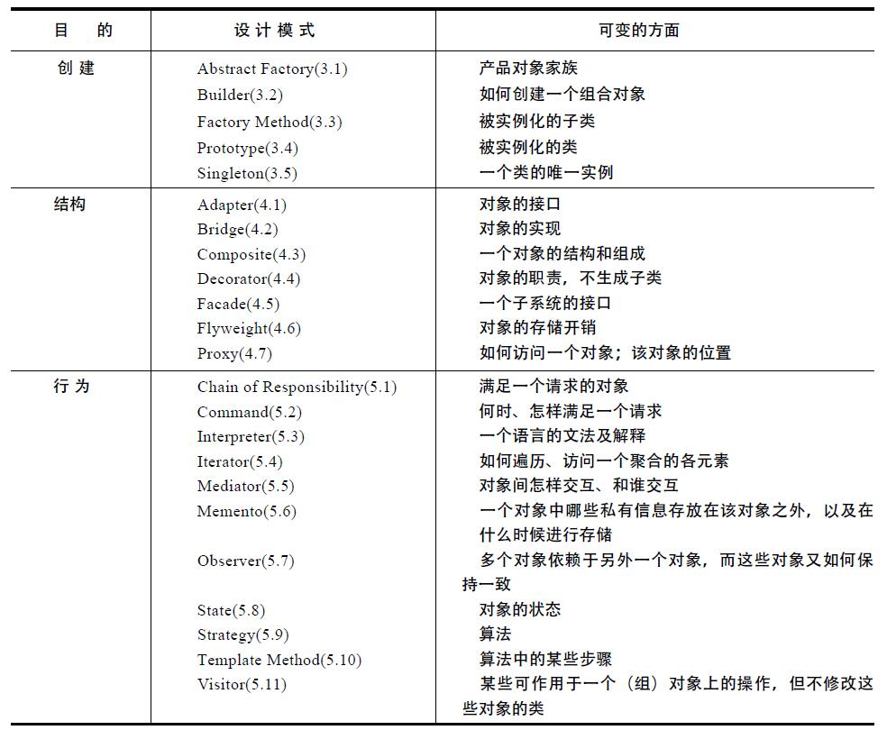

## creational 创建型

|  名称  |                      意图                      |
|--------|------------------------------------------------|
|抽象工厂| 提供一个创建一系列相关或相互依赖对象的接口，而无需指定它们具体的类  |
| 建造者 | 将一个复杂对象的构建与它的表示分离，使得同样的构建过程可以创建不同的表示  |
|工厂方法| 定义一个用于创建对象的接口，让子类决定实例化哪一个类。Factory Method 使一个类的实例化延迟到其子类  |
|  原型  | 用原型实例指定创建对象的种类，并且通过拷贝这些原型创建新的对象  |
|  单件  | 保证一个类仅有一个实例，并提供一个访问它的全局访问点  |

### 抽象工厂

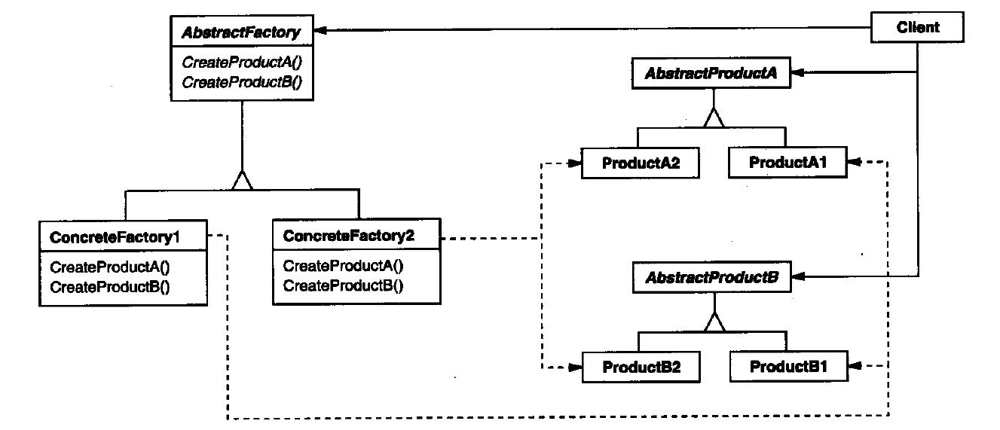

### 建造者

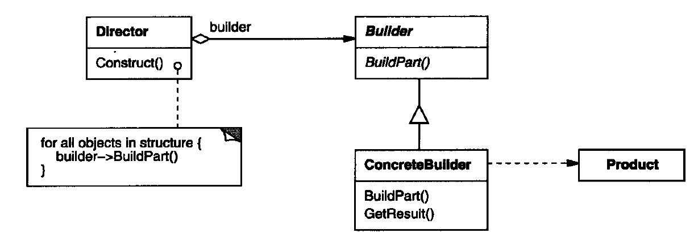

### 工厂方法

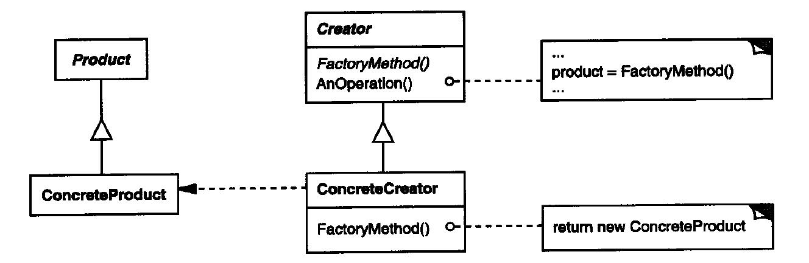

### 原型

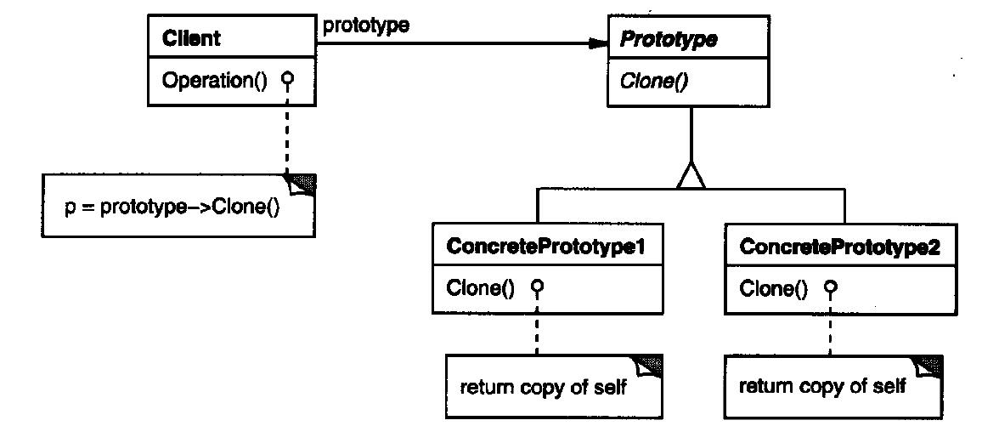

### 单件

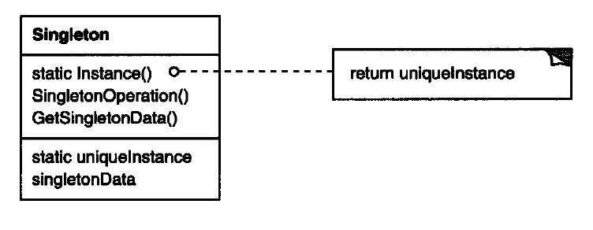

## structural 结构型

|  名称  |                      意图                      |
|--------|------------------------------------------------|
| 适配器 |  将一个接口转化为客户希望的另外一个接口，Adaptor 模式使得原本由于接口不兼容无法一起工作的那些类可以一起工作  |
|  桥接  |  将抽象部分与它的实现部分相分离，使得它们都可以独立变化 |
|  组合  |  将对象组合成树形结构以表示“部分-整体”的层次结构，Composite 模式使得用户对单个对象和组合对象的使用具有一致性 |
|  装饰  |  动态地给一个对象添加功能。就增加功能来说，Decorator 模式相比生成子类更为灵活 |
|  外观  |  为子系统中的一组接口提供一个一致的界面，Facade 模式定义了一个高层接口，这个接口使得子系统更加容易使用 |
|  享元  |  运用共享技术有效地支持大量细粒度的对象 |
|  代理  |  为其他对象提供一种代理以控制对这个对象的访问 |

### 适配器

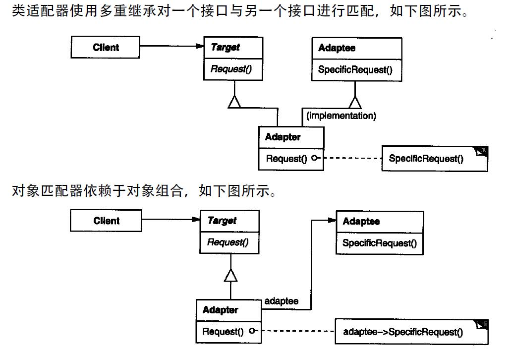

### 桥接

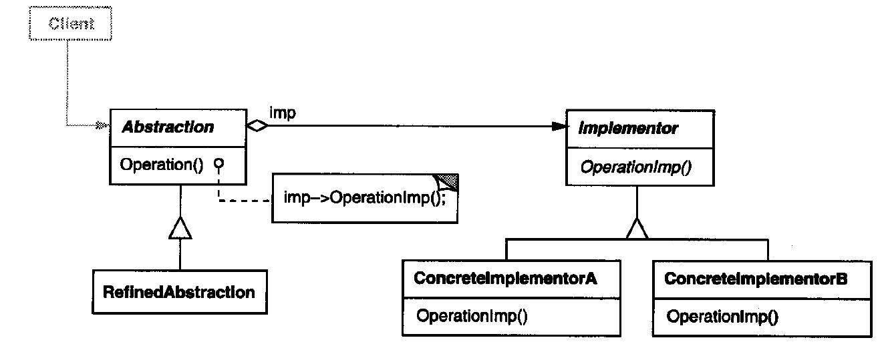

### 组合

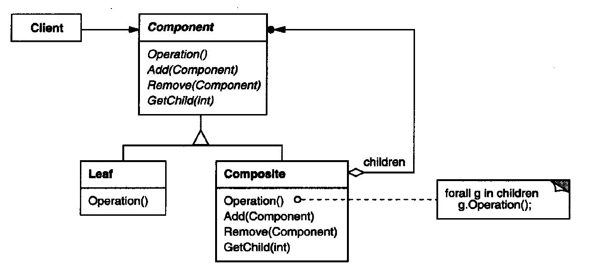

### 装饰

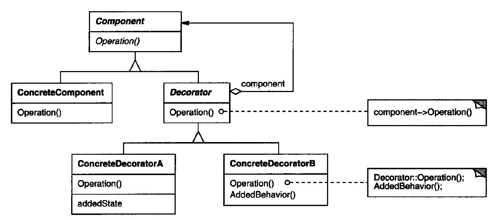

### 外观

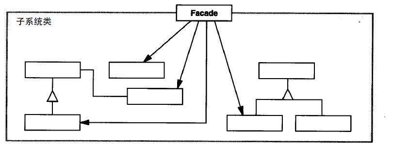

### 享元

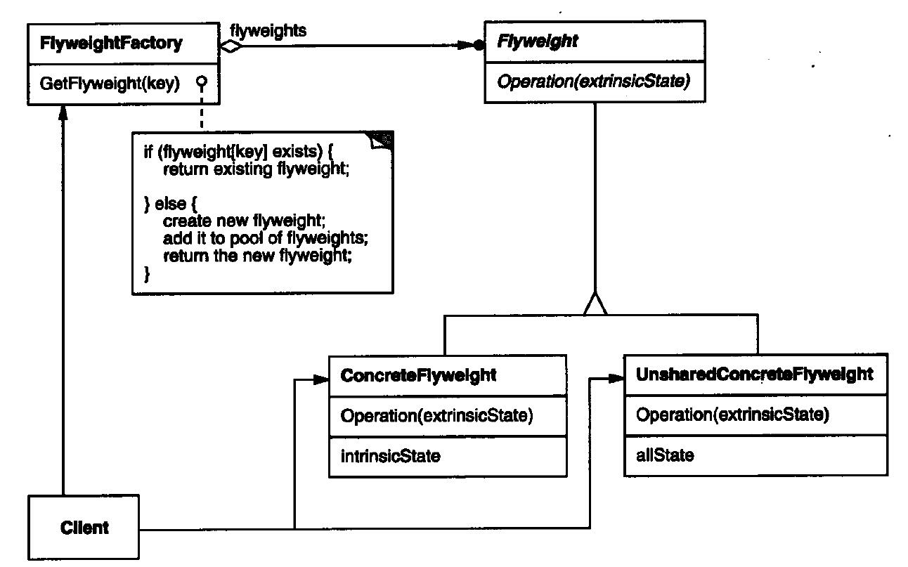

### 代理

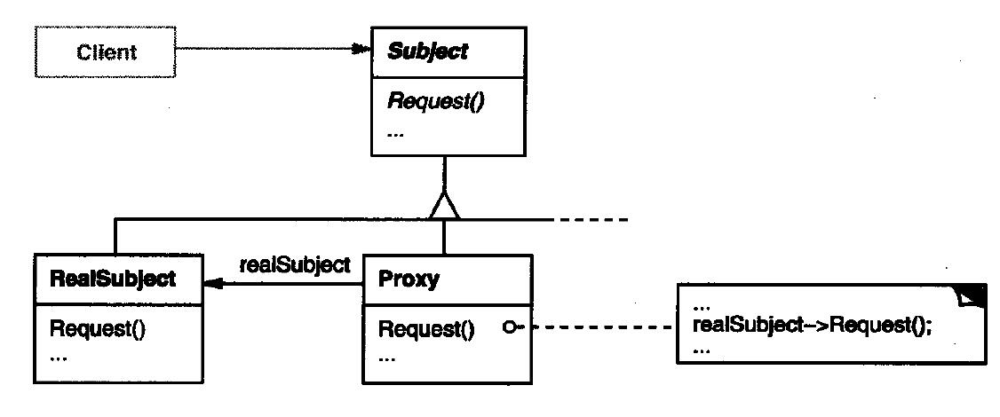

## behavioral 行为型
