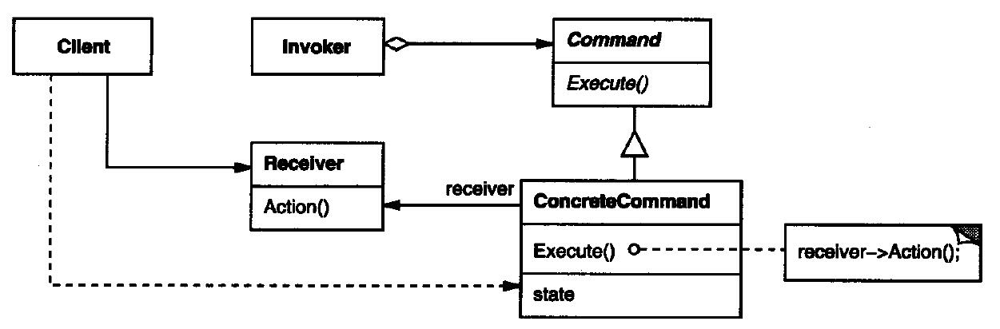
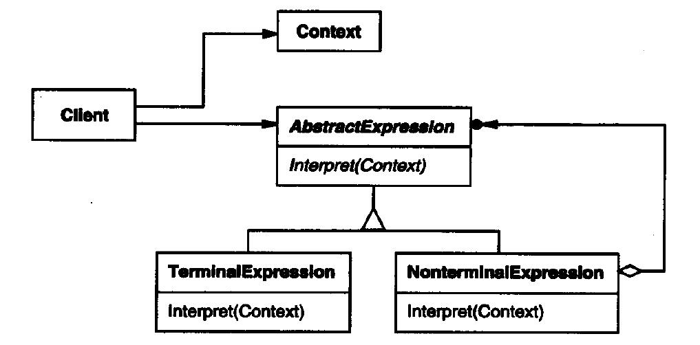
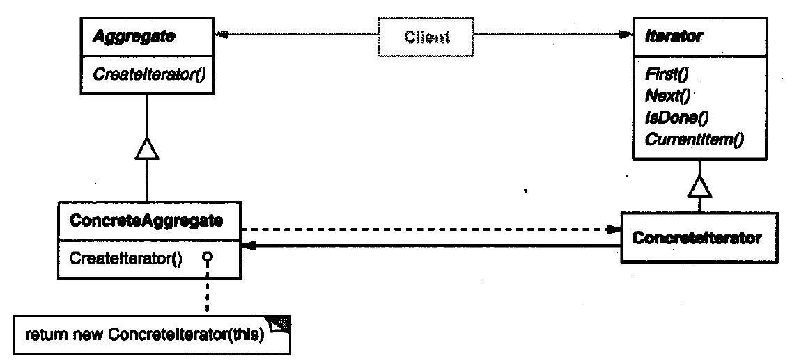
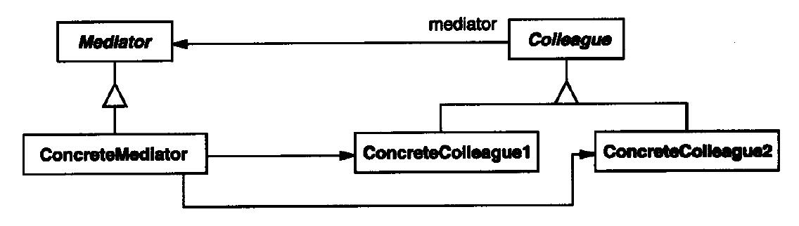
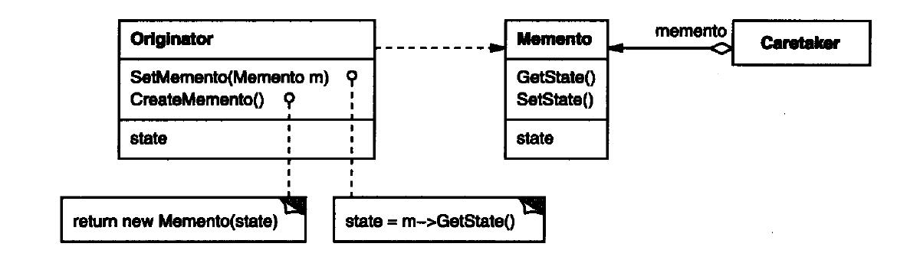
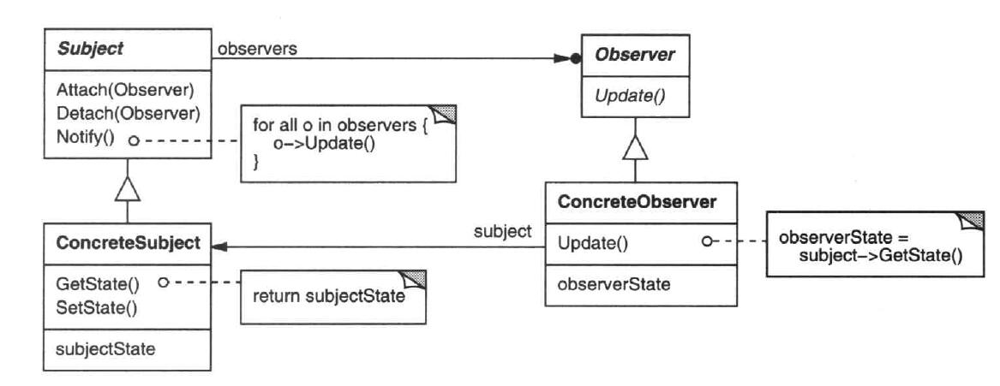
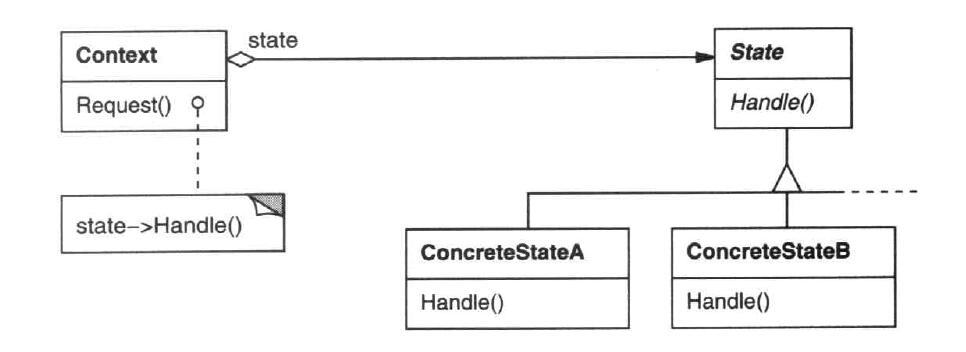
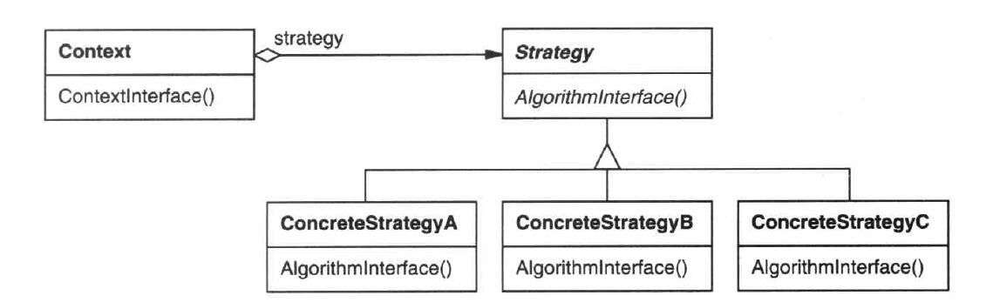
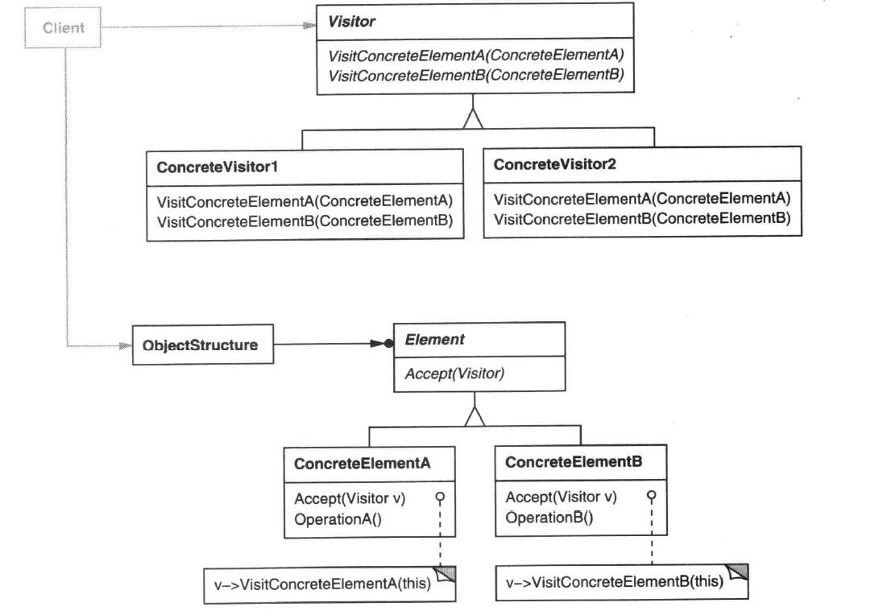

# 设计模式

假设 Client 与 系统代码是分离的(不是同一个人写的)

在 外观模式中，如果出现变动，只需要改变 Facade 类 不需要修改 Client 代码

## creational 创建型

|  名称  |                      意图                      |
|--------|------------------------------------------------|
|抽象工厂| 提供一个创建一系列相关或相互依赖对象的接口，而无需指定它们具体的类  |
| 建造者 | 将一个复杂对象的构建与它的表示分离，使得同样的构建过程可以创建不同的表示  |
|工厂方法| 定义一个用于创建对象的接口，让子类决定实例化哪一个类。Factory Method 使一个类的实例化延迟到其子类  |
|  原型  | 用原型实例指定创建对象的种类，并且通过拷贝这些原型创建新的对象  |
|  单件  | 保证一个类仅有一个实例，并提供一个访问它的全局访问点  |

### 抽象工厂

### 建造者

### 工厂方法

### 原型

### 单件

## structural 结构型

|  名称  |                      意图                      |
|--------|------------------------------------------------|
| 适配器 |  将一个接口转化为客户希望的另外一个接口，Adaptor 模式使得原本由于接口不兼容无法一起工作的那些类可以一起工作  |
|  桥接  |  将抽象部分与它的实现部分相分离，使得它们都可以独立变化 |
|  组合  |  将对象组合成树形结构以表示“部分-整体”的层次结构，Composite 模式使得用户对单个对象和组合对象的使用具有一致性 |
|  装饰  |  动态地给一个对象添加功能。就增加功能来说，Decorator 模式相比生成子类更为灵活 |
|  外观  |  为子系统中的一组接口提供一个一致的界面，Facade 模式定义了一个高层接口，这个接口使得子系统更加容易使用 |
|  享元  |  运用共享技术有效地支持大量细粒度的对象 |
|  代理  |  为其他对象提供一种代理以控制对这个对象的访问 |

### 适配器

### 桥接

### 组合

### 装饰

### 外观

### 享元

### 代理

## behavioral 行为型

|  名称  |                      意图                      |
|--------|------------------------------------------------|
| 职责链 | 使多个对象都有机会处理请求，从而避免请求的发送者和处理者之间的耦合关系，将这些对象连成一条链，并沿着这条链传递该请求，直到有一个对象处理它为止。  |
|  命令  | 将一个请求封装成一个对象，从而使得可用不同的对象对客户进行参数化；对请求排队，或记录请求日志，以及支持可撤消的操作  |
| 解释器 | 定义一种语言，定义它的文法的一种表示，并定义一个解释器，这个解释器使用该表示来解释语言中的句子  |
| 迭代器 | 提供一种方法顺序访问一个聚合对象中各个元素, 而又不需暴露该对象的内部表示  |
| 中介者 | 使用一个中介对象来封装一系列对象之间的交互。中介者使各对象无需显式地相互引用，从而使其耦合松散，而且可以独立地改变它们之间的交互  |
| 备忘录 | 在不破坏封装性的前提下，捕获一个对象的内部状态，并在该对象之外保存这个状态。这样以后就可将该对象恢复到原先保存的状态。  |
| 观察者 | 定义对象间的一种一对多的依赖关系,当一个对象的状态发生改变时, 所有依赖于它的对象都得到通知并被自动更新。  |
|  状态  | 允许一个对象在其内部状态改变时改变它的行为。对象看起来似乎修改了它的类。  |
|  策略  |  定义一系列的算法,把它们一个个封装起来, 并且使它们可相互替换。本模式使得算法可独立于使用它的客户而变化。 |
|模板方法| 定义一个操作中的算法的骨架，而将一些步骤延迟到子类中。本模式使得子类可以不改变一个算法的结构即可重定义该算法的某些特定步骤。  |
| 访问者 | 表示一个作用于某对象结构中的各元素的操作。它使你可以在不改变各元素的类的前提下定义作用于这些元素的新操作。  |

### 职责链 

### 命令  

### 解释器 

### 迭代器 

### 中介者 

### 备忘录 

### 观察者 

### 状态  

### 策略  

### 模板方法

### 访问者 

